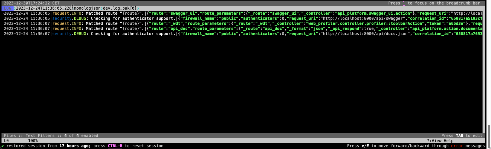

# Lnav monolog formats
[Lnav](https://lnav.org/) formats to support [seldaek/monolog](https://github.com/Seldaek/monolog). Specifically:
- Line formatter
- JSON formatter



## Installation
```bash
lnav -i https://github.com/ostrolucky/lnav-formats.git
```