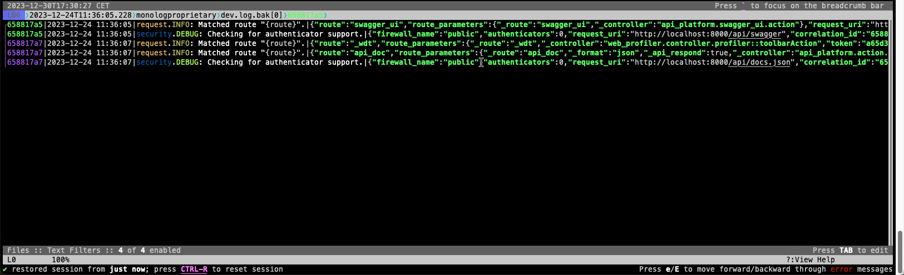

# Proprietary formats

This folder contains opinionated formats that I personally use, but will not have much use for anyone else other than taking inspiration from it. 

It has extra features, such as: 
- Correlation/Trace/Operation ID support, depending on how you call it. You can hit `o`/`shift+O` to follow the logs in same transaction.
- Hiding some fields appended by our log shipper that I want to ignore
- Default filters that I commonly use
- User resolution from uuid, visible in pretty-print (`shift+P`) view (requires SQL that's not shipped in this repository)



## Installation
Lnav doesn't seem to auto-install these formats when installing them from repository directly. Install manually instead:
```bash
lnav -i lnav-formats/proprietary/*.{sql,json}
```